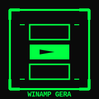

# WinampGera Music Player

A modern Python-based music player with a neon-green geometric tech theme, inspired by the classic Winamp interface.



## Features

- 🎵 **Multi-format Support**: Play MP3, WAV, and FLAC audio files
- ▶️ **Playback Controls**: Play, Pause, and Stop functionality
- 🔊 **Volume Control**: Adjustable volume slider (0-100%)
- 🎨 **Modern Theme**: Neon-green (#00ff41) geometric tech design on dark background
- 🖥️ **Simple Interface**: Clean, intuitive GUI built with tkinter
- 🚀 **VLC Backend**: Powered by python-vlc for robust audio playback

## Requirements

- Python 3.7 or higher
- VLC media player installed on your system
- tkinter (usually included with Python)

## Installation

1. Clone the repository:
```bash
git clone https://github.com/Blackmvmba88/winampGera.git
cd winampGera
```

2. Install Python dependencies:
```bash
pip install -r requirements.txt
```

3. Make sure VLC media player is installed on your system:
   - **Windows**: Download from [videolan.org](https://www.videolan.org/vlc/)
   - **macOS**: `brew install vlc` or download from videolan.org
   - **Linux**: `sudo apt-get install vlc` (Ubuntu/Debian) or `sudo dnf install vlc` (Fedora)

## Usage

Run the application:
```bash
python winampgera.py
```

Or make it executable (Linux/macOS):
```bash
chmod +x winampgera.py
./winampgera.py
```

### Controls

- **OPEN**: Click to browse and select an audio file (MP3, WAV, or FLAC)
- **PLAY**: Start playback or resume if paused (becomes PAUSE when playing)
- **STOP**: Stop playback completely
- **VOLUME**: Use the slider to adjust volume from 0% to 100%

## Project Structure

```
winampGera/
├── winampgera.py       # Main application file
├── requirements.txt    # Python dependencies
├── README.md          # This file
└── assets/
    └── icon.svg       # Application icon
```

## Design Theme

WinampGera features a distinctive neon-green geometric tech aesthetic:
- **Primary Color**: Neon Green (#00ff41)
- **Background**: Dark (#0a0a0a)
- **Accents**: Geometric shapes and borders
- **Font**: Courier New (monospace)
- **Style**: High-tech, minimalist, retro-futuristic

## Dependencies

- `python-vlc==3.0.18121` - Python bindings for VLC media player
- `Pillow==10.1.0` - Python Imaging Library (for potential future enhancements)

## Troubleshooting

### VLC not found
If you get an error about VLC not being found:
- Ensure VLC is properly installed on your system
- On Windows, make sure VLC is in your PATH or installed in the default location
- On Linux, install the libvlc-dev package: `sudo apt-get install libvlc-dev`

### Audio file won't play
- Verify the file format is MP3, WAV, or FLAC
- Check that the file is not corrupted
- Ensure VLC can play the file independently

## License

This project is open source and available for educational and personal use.

## Author

Created by Blackmvmba88

## Acknowledgments

- Inspired by the classic Winamp media player
- Built with Python, tkinter, and VLC
